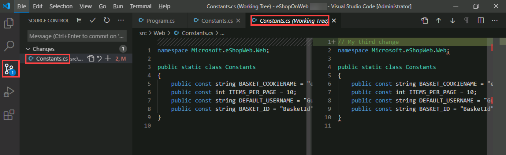
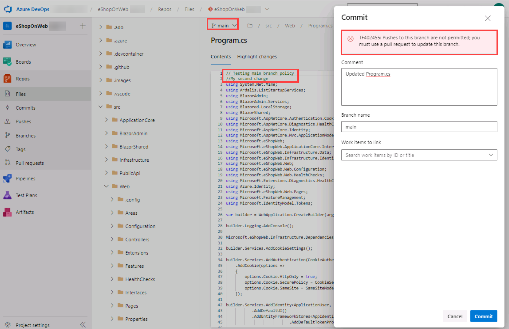

---
lab:
  title: Version Controlling with Git in Azure Repos
  module: 'Module 02: Work with Azure Repos and GitHub'
---

# Version Controlling with Git in Azure Repos

## Manual de laboratório do aluno

## Requisitos do laboratório

- Este laboratório requer o **Microsoft Edge** ou um [navegador compatível com o Azure DevOps.](https://docs.microsoft.com/azure/devops/server/compatibility)

- **Configurar uma organização do Azure DevOps:** se você ainda não tiver uma organização Azure DevOps que possa usar para este laboratório, crie uma seguindo as instruções disponíveis em [Criar uma organização ou coleção de projetos](https://docs.microsoft.com/azure/devops/organizations/accounts/create-organization).

- Se você não tiver o Git 2.29.2 ou posterior instalado ainda, inicie um navegador da Web, navegue até a página de [download do Git para Windows](https://gitforwindows.org/) o baixe e instale-o.
- Se você não tiver o Visual Studio Code instalado ainda, inicie um navegador da Web, navegue até a página de [, download do Visual Studio Code](https://code.visualstudio.com/) o baixe e instale-o.
- Se você não tiver a extensão C# do Visual Studio Code instalada ainda, inicie um navegador da Web, navegue até a página de [ da página de instalação de extensão C# ](https://marketplace.visualstudio.com/items?itemName=ms-dotnettools.csharp) o baixe e instale-o.

## Visão geral do laboratório

O Azure DevOps dá suporte a dois tipos de controle de versão, Git e TFVC (Controle de Versão do Team Foundation). Observe a visão geral rápida dos dois sistemas de controle de versão:

- **TFVC (Controle de Versão do Team Foundation):** o TFVC é um sistema de controle de versão centralizado. Normalmente, os membros da equipe têm somente uma versão de cada arquivo nos computadores de desenvolvimento. Os dados históricos são mantidos somente no servidor. As branches são baseadas em caminho e criadas no servidor.

- **Git:** o Git é um sistema de controle de versão distribuído. Os repositórios Git podem ser posicionados localmente (no computador de um desenvolvedor). Cada desenvolvedor tem uma cópia do repositório de origem em seu computador de desenvolvimento. Os desenvolvedores podem confirmar cada conjunto de alterações em seu computador de desenvolvimento e executar operações de controle de versão, como histórico e comparação, sem uma conexão de rede.

O Git é o provedor de controle de versão padrão para novos projetos. Você deve usar o Git para controle de versão em seus projetos, a menos que precise de recursos centralizados de controle de versão no TFVC.

Neste laboratório, você aprenderá a estabelecer um repositório Git local, que pode ser sincronizado facilmente com um repositório Git centralizado no Azure DevOps. Além disso, você aprenderá sobre o suporte de branch e mesclagem do Git. Você usará o Visual Studio Code, mas os mesmos processos se aplicam ao uso de qualquer cliente compatível com Git.

## Objetivos

Após concluir este laboratório, você poderá:

- Clone um repositório.
- Salve o trabalho com commits.
- Examine o histórico de alterações.
- Trabalhe com branches usando o Visual Studio Code.

## Tempo estimado: 60 minutos

## Instruções

### Exercício 0: configurar os pré-requisitos do laboratório

Neste exercício, você configurará os pré-requisitos para o laboratório, que consistem em um novo projeto do Azure DevOps com um repositório baseado no [eShopOnWeb](https://github.com/MicrosoftLearning/eShopOnWeb).

#### Tarefa 1: (ignorar se concluído) Criar e configurar o projeto de equipe

Nesta tarefa, você criará um **projeto do Azure DevOps eShopOnWeb** para ser usado por vários laboratórios.

1. No computador do laboratório, em uma janela do navegador, abra sua organização do Azure DevOps. Clique em **Novo Projeto**. Dê ao seu projeto o nome **eShopOnWeb** e escolha **Scrum** na lista suspensa Processo de **item** de trabalho. Clique em **Criar**.

    

#### Tarefa 2: (ignorar se concluído) Importar repositório Git do eShopOnWeb

Nesta tarefa você importará o repositório Git do eShopOnWeb para ser usado por vários laboratórios.

1. No computador do laboratório, em uma janela do navegador, abra sua organização do Azure DevOps **eShopOnWeb**. Clique em **Repos>Files** , **Import **. Na janela **Importar um repositório Git**, cole a seguinte URL https://github.com/MicrosoftLearning/eShopOnWeb.git e clique em **Importar**:

    

2. O repositório está organizado da seguinte forma:
    - A pasta **.ado** contém os pipelines YAML do Azure DevOps
    - O contêiner da pasta **.devcontainer** está configurado para o desenvolvimento usando contêineres (localmente no VS Code ou no GitHub Codespaces)
    - **A pasta .azure** contém a infraestrutura Bicep&ARM como modelos de código usados em alguns cenários do laboratório.
    - **A pasta .github** definições de fluxo de trabalho YAML GitHub do contêiner da pasta.
    - A pasta **src** contém o site .NET 6 usado nos cenários do laboratório.

#### Tarefa 3: configurar o Git e o Visual Studio Code

Nesta tarefa, você instalará e configurará o Git e o Visual Studio Code, incluindo a configuração do auxiliar de credenciais do Git para armazenar com segurança as credenciais do Git usadas para se comunicar com o Azure DevOps. Se você já tiver implementado esses pré-requisitos, poderá prosseguir diretamente para a próxima tarefa.

1. No computador de laboratório, abra **o Visual Studio Code**.
2. Na interface do Visual Studio Code, no menu principal, selecione **Terminal \| Novo Terminal** para abrir o painel **TERMINAL**.
3. Verifique se o Terminal atual está executando **o PowerShell** , verificando se a lista suspensa no canto superior direito do **painel TERMINAL** mostra **1: powershell**

    > **Observação**: para alterar o shell do Terminal atual para **o PowerShell** , clique na lista suspensa no canto superior direito do **painel TERMINAL** e clique em **Selecionar Shell Padrão**. Na parte superior da janela Visual Studio Code, selecione seu shell de terminal preferido, o Windows PowerShell **, e clique no sinal de adição no lado direito da lista suspensa para abrir um novo terminal com o shell **padrão selecionado.

4. No painel **TERMINAL, execute o **seguinte comando abaixo para configurar o auxiliar de credenciais.

    ```git
    git config --global credential.helper wincred
    ```

5. No painel **TERMINAL, execute os **seguintes comandos para configurar um nome de usuário e email para confirmações do Git (substitua os espaços reservados entre chaves pelo seu nome de usuário e email preferidos, eliminando os símbolos < e >):

    ```git
    git config --global user.name "<John Doe>"
    git config --global user.email <johndoe@example.com>
    ```

### Exercício 1: clonar um repositório existente

Neste exercício, você usa o Visual Studio Code para clonar o repositório Git provisionado como parte do exercício anterior.

#### Tarefa 1: clonar um repositório existente

Nesta tarefa, você passará pelo processo de clonagem de um repositório Git usando o Visual Studio Code.

1. Acesse a guia do navegador da Web que exibe sua organização do Azure DevOps com o **projeto EShopOnWeb** gerado no exercício anterior.
2. No painel de navegação vertical do portal do Azure DevOps, selecione o **ícone Repos**.

3. No canto superior direito do painel do **repositório eShopOnWeb**, clique em **Clonar**.

    

    > **Observação**: obter uma cópia local de um repositório Git é chamado *de clonagem*. Todas as ferramentas de desenvolvimento principais oferecem suporte a isso e poderão se conectar ao Azure Repos para extrair a fonte mais recente com a qual trabalhar.

4. No painel **Clonar repositório** com a opção **Linha de comando HTTPS** selecionada, clique no botão **Copiar para a área de transferência** ao lado da URL do clone do repositório.

    > **Observação**: você pode usar essa URL com qualquer ferramenta compatível com Git para obter uma cópia da base de código.

5. Feche o **painel Repositório de clones**.
6. Alterne para o **Visual Studio Code** em execução no computador do laboratório.
7. Clique no cabeçalho do **menu Exibir** e, no menu suspenso, clique em **Paleta de Comandos**.

    > **Observação**: a Paleta de Comandos fornece uma maneira fácil e conveniente de acessar uma ampla variedade de tarefas, incluindo aquelas implementadas como extensões de terceiros. Você também pode usar o atalho de teclado **Ctrl+Shift+P** ou **F1** para abri-lo.

8. No prompt da Paleta de Comandos, execute o **comando Git: Clone** .

    

    > **Observação**: para ver todos os comandos relevantes, você pode começar digitando **Git**.

9. Na caixa de texto **Fornecer URL do repositório ou escolher uma fonte de origem do repositório**, cole a URL do clone de repositório copiada anteriormente nesta tarefa e pressione a tecla **Enter**.
10. Na **caixa de diálogo Selecionar pasta, navegue até a unidade C:, crie uma nova pasta** chamada **Git**, selecione-a e clique em **Selecionar local** do repositório.
11. Quando solicitado, entre em sua conta Azure DevOps.
12. Depois que o processo de clonagem for concluído, uma vez solicitado, no Visual Studio Code, clique em **Abrir** para abrir o repositório clonado.

    > **Observação**: você pode ignorar avisos que você pode receber sobre problemas com o carregamento do projeto. A solução pode não estar na etapa adequada para uma construção, mas vamos nos concentrar em trabalhar com o Git, então a construção do projeto não é necessária.

### Exercício 2: salvar trabalho com confirmações

Neste exercício, você percorrerá vários cenários que envolvem o uso do Visual Studio Code para preparar e confirmar alterações.

Quando você fizer alterações em seus arquivos, o Git registrará as alterações no repositório local. Você pode selecionar as alterações que deseja confirmar preparando-as. As confirmações são sempre feitas em seu repositório Git local, para que você não precise se preocupar se a confirmação for perfeita ou pronta para compartilhar com outras pessoas. Você pode fazer mais confirmações à medida que continua a trabalhar e enviar as alterações para outras pessoas quando elas estiverem prontas para serem compartilhadas.

As confirmações do Git consistem no seguinte:

- Os arquivos alterados na confirmação. O Git mantém o conteúdo de todas as alterações de arquivo em seu repositório nas confirmações. Isso o mantém rápido e permite a fusão inteligente.
- Uma referência à confirmação pai. O Git gerencia seu histórico de código usando essas referências.
- Uma mensagem descrevendo uma confirmação. Você dá essa mensagem ao Git quando cria a confirmação. É uma boa ideia manter essa mensagem descritiva, mas direto ao ponto.

#### Tarefa 1: confirmar alterações

Nesta tarefa, você instalará o Visual Studio Code para confirmar alterações.

1. Na janela Visual Studio Code, na parte superior da barra de ferramentas vertical, selecione a **guia EXPLORER**, navegue até o arquivo /eShopOnWeb/src/Web/Program.cs** e selecione-o**. Isso exibirá automaticamente seu conteúdo no painel de detalhes.
2. Adicione as seguintes linhas após o comentário:

    ```csharp
    // My first change
    ```

    > **Observação**: não importa realmente qual é o comentário, já que o objetivo é apenas fazer uma mudança.

3. Pressione **Ctrl+S** para salvar as alterações.
4. Na janela Visual Studio Code, selecione a guia CONTROLE DO CÓDIGO-FONTE** para verificar se o Git reconheceu a **alteração mais recente no arquivo que reside no clone local do repositório Git.
5. Com a guia **CONTROLE DO CÓDIGO-FONTE** selecionada, na parte superior do painel, na caixa de texto, digite **Minha confirmação** como a mensagem de confirmação e pressione **Ctrl+Enter** para confirmá-la localmente.

    

6. Se lhe for perguntado se pretende preparar automaticamente as alterações e confirmá-las diretamente, clique em **Sempre**.

    > **Observação**: discutiremos **o estadiamento** mais tarde no laboratório.

7. No canto inferior esquerdo da janela Visual Studio Code, à direita do **rótulo principal**, observe o ícone Sincronizar alterações** de um círculo com duas setas verticais apontando para direções opostas e o **número **1** ao lado da seta apontando para cima. Clique no ícone e, se solicitado, se deseja continuar, clique em **OK** para enviar e receber confirmações de e para **origem/principal**.

#### Tarefa 2: revisões de confirmações

Nesta tarefa, você usará o portal do Azure DevOps para revisar confirmações.

1. Alterne para a janela do navegador da Web que está exibindo o portal Azure DevOps.
2. No painel de navegação vertical do portal do Azure DevOps, selecione a seção **Repos**, selecione **Confirmações**.
3. Verifique se a confirmação aparece na parte superior da lista.

    

#### Tarefa 3: preparar alterações

Nesta tarefa, você explorará o uso de alterações de preparação usando o Visual Studio Code. As alterações de preparação permitem que você adicione seletivamente determinados arquivos a uma confirmação enquanto passa as alterações feitas em outros arquivos.

1. Reverta para a janela **Visual Studio Code**.
2. Atualize a classe Program.cs** aberta **alterando o primeiro comentário com o seguinte e salvando o arquivo.

    ```csharp
        //My second change
    ```

3. Na janela Visual Studio Code, reverta para a **guia EXPLORER**, navegue até o arquivo /eShopOnWeb/src/Web/Constants.cs** e selecione-o**. Isso exibirá automaticamente seu conteúdo no painel de detalhes.
4. Adicione ao **arquivo Constants.cs** um comentário na primeira linha e salve o arquivo.

    ```csharp
    // My third change
    ```

5. Na janela Visual Studio Code, alterne para a guia **CONTROLE DO CÓDIGO-FONTE**, passe o ponteiro do mouse sobre a entrada **Program.cs** e clique no sinal de adição no lado direito dessa entrada.

    > **Observação**: isso prepara a alteração apenas para o arquivo **Program.cs**, preparando-o para confirmar sem **Constants.cs**.

6. Com a guia **CONTROLE DO CÓDIGO-FONTE** selecionada, na parte superior do painel, digite **Comentários adicionados** como a mensagem de confirmação.

    

7. Na parte superior da guia **CONTROLE DO CÓDIGO-FONTE** clique no símbolo de reticências, no menu suspenso, selecione **Confirmar** e, no menu em cascata, selecione **Confirmar em etapas**.
8. No canto inferior esquerdo da janela Visual Studio Code, clique no **botão Sincronizar Alterações** para sincronizar as alterações confirmadas com o servidor e, se solicitado, se deseja continuar, clique em **OK** para enviar e receber confirmações de e para **origem/principal**.

    > **Observação**: observe que, como apenas a alteração em etapas foi confirmada, a outra alteração ainda está pendente para ser sincronizada.

### Exercício 3: examinar o histórico

Neste exercício, você usará o portal do Azure DevOps para revisar o histórico das confirmações.

O Git usa as informações de referência pai armazenadas em cada confirmação para gerenciar um histórico completo do seu desenvolvimento. Você pode facilmente revisar esse histórico de confirmação para descobrir quando as alterações de arquivo foram feitas e determinar as diferenças entre as versões do seu código usando o terminal ou de uma das muitas extensões do Visual Studio Code disponíveis. Você também pode exibir dados usando o portal Azure DevOps.

O uso do recurso Branches e Mesclagens** pelo Git funciona por meio de solicitações de pull, portanto, o histórico de confirmação do seu desenvolvimento não necessariamente forma uma linha reta **e cronológica. Ao usar o histórico para comparar versões, pense em termos de alterações de arquivo entre duas confirmações em vez de alterações de arquivo entre dois pontos no tempo. Uma alteração recente em um arquivo no branch principal pode ter vindo de uma confirmação criada há duas semanas em um branch de recurso que foi mesclada ontem.

#### Tarefa 1: comparar arquivos

Nesta tarefa, você percorrerá o histórico de confirmações usando o portal do Azure DevOps.

1. Com a guia **CONTROLE DO CÓDIGO-FONTE** da janela Visual Studio Code aberta, selecione **Constants.cs** representando a versão sem etapas do arquivo.

    

    > **Observação**: uma exibição de comparação é aberta para permitir que você localize facilmente as alterações feitas. Neste caso, é apenas um comentário.

2. Alterne para a janela do navegador da Web que exibe o painel **Confirmações** do portal do **Azure DevOps** para revisar os branches e mesclagens de origem. Eles fornecem uma maneira conveniente de visualizar quando e como as alterações foram feitas na fonte.
3. Role para baixo até a entrada **My commit** (pressionada antes) e passe o ponteiro do mouse sobre ela para revelar o símbolo de reticências no lado direito.
4. Clique nas reticências, no menu suspenso, selecione **Procurar arquivos** e revise os resultados.

    

    > **Observação**: esta vista representa a etapa da origem correspondente à confirmação, permitindo-lhe rever e transferir cada um dos arquivos de origem.

### Exercício 4: trabalhar com branches

Neste exercício, você percorrerá cenários que envolvem o gerenciamento de branches usando o Visual Studio Code e o portal do Azure DevOps.

Você pode gerenciar em seu repositório Git do Azure DevOps no modo de exibição **Branches** do **Azure Repos** no portal do Azure DevOps. Você também pode personalizar o modo de exibição para acompanhar os branches mais importantes para que você possa ficar por dentro das alterações feitas por sua equipe.

A confirmação de alterações em um branch não afetará outras branches e você poderá compartilhar branches com outras sem precisar mesclar as alterações no projeto principal. Você também pode criar novos branches para isolar as alterações de um recurso ou uma correção de bug do branch principal e de outro trabalho. Como os branches são leves, alternar entre eles é rápido e fácil. O Git não cria várias cópias de seu código-fonte ao trabalhar com branches. Ele usa as informações de histórico armazenadas nas confirmações para recriar os arquivos em um branch quando você começa a trabalhar nele. Seu fluxo de trabalho do Git deve criar e usar os branches para gerenciar recursos e correções de bugs. O restante do fluxo de trabalho do Git, como o compartilhamento de código e a revisão de código com solicitações de pull, funciona completamente por meio de branches. Isolar o trabalho em branches simplifica muito a alteração daquilo em que você está trabalhando, através da alteração do branch atual.

#### Tarefa 1: crie um novo branch no repositório local

Nesta tarefa, você criará um branch usando o Visual Studio Code.

1. Alterne para o **Visual Studio Code** em execução no computador do laboratório.
2. Com a guia **CONTROLE DO CÓDIGO-FONTE** selecionada, no canto inferior esquerdo da janela Visual Studio Code, clique em **principal**.
3. Na janela pop-up, selecione **+ Criar novo branch de...**.

    

4. Na caixa de texto Nome do **branch**, digite **dev** para especificar o novo branch e pressione Enter.****
5. Na caixa de texto **Selecione uma ref para criar o branch 'dev’** da caixa de texto, selecione **main** como o branch de referência.

    > **Observação**: neste ponto, você é automaticamente alternado para o **branch de desenvolvimento** .

#### Tarefa 2: excluir um branch

Nesta tarefa, você usará o Visual Studio Code para trabalhar com um branch criado na tarefa anterior.

O Git controla em qual branch você está trabalhando e garante que, quando você faz a verificação de algum branch, seus arquivos corresponderão à confirmação mais recente no branch. Os branches permitem que você trabalhe com várias versões do código-fonte no mesmo repositório Git local ao mesmo tempo. Você pode usar o Visual Studio Code para publicar, fazer check-out e excluir branches.

1. Na janela **Visual Studio Code** com a guia **CONTROLE DO CÓDIGO-FONTE** selecionada, no canto inferior esquerdo da janela Visual Studio Code, clique no ícone **Publicar alterações** (diretamente à direita da etiqueta de desenvolvimento**dev** que representa seu branch recém-criado).
2. Alterne para a janela do navegador da Web que exibe o painel **Confirmações** do portal **do Azure DevOps** e selecione **Branches**.
3. Na guia **Mine** do painel **Branches**, verifique se a lista de branches inclui **desenvolvimento**.
4. Passe o ponteiro do mouse sobre a entrada do branch de **desenvolvimento** para revelar o símbolo de reticências no lado direito.
5. Clique nas reticências, no menu pop-up, selecione **Excluir branch** e, quando for solicitada a confirmação, clique em **Excluir**.

    

6. .Alterne de volta para a janela **Visual Studio Code** e, com a guia **CONTROLE DO CÓDIGO-FONTE** selecionada, no canto inferior esquerdo da janela Visual Studio Code, clique na entrada **dev**. Isso exibirá os branches existentes na parte superior da janela Visual Studio Code.
7. Verifique se agora há dois **branches de desenvolvimento** listadas.

    > **Observação**: O branch local (**desenvolvimento**) é listado porque sua existência não é afetada pela exclusão do branch no repositório remoto. O servidor (**origem/desenvolvimento**) está listado porque não foi removido.

8. Na lista de branches selecione o **branch** principal para verificá-lo.
9. Pressione **Ctrl+Shift+P** para abrir a **Paleta de Comandos**.
10. No prompt da **Paleta de Comandos**, comece digitando**Git: Delete** e selecione **Git: Delete Branch** quando ele ficar visível.
11. Selecione a entrada de **desenvolvimento** na lista de branches a deletar.
12. No canto inferior esquerdo da janela Visual Studio Code, clique na **entrada principal** novamente. Isso exibirá os branches existentes na parte superior da janela Visual Studio Code.
13. Verifique se o branch de desenvolvimento local **não aparece mais na lista, mas a origem/desenvolvimento**** remoto **ainda está lá.
14. Pressione **Ctrl+Shift+P** para abrir a **Paleta de Comandos**.
15. No prompt da **Paleta de Comandos**, comece a digitar **Git: Fetch** e selecione **Git: Fetch (Prune)** quando ele ficar visível.

    > **Observação**: este comando atualizará os branches de origem no instantâneo local e excluirá aqueles que não estão mais lá.

    > **Observação**: você pode fazer check-in exatamente o que essas tarefas estão fazendo selecionando a **janela Saída** na parte inferior direita inferior da janela Visual Studio Code. Se você não vir os logs do Git no console de saída, certifique-se de selecionar **Git** como a origem.

16. No canto inferior esquerdo da janela Visual Studio Code, clique na **entrada principal** novamente.
17. Verifique se o **branch origin/dev** não aparece mais na lista de branches.

#### Tarefa 3: restaurar um branch

Nesta tarefa, você usará o portal do Azure DevOps para restaurar o branch excluído na tarefa anterior.

1. Vá para o navegador da Web que exibe a guia **Mine** do painel **Branches** no portal do Azure DevOps.
2. Na guia **Mine** do painel **Branches**, selecione a guia **All**.
3. Na guia **All** do painel **Branches**, na caixa de texto **Search branch name**, digite **dev**.
4. Revise a seção ** branches excluídas que contém a entrada que representa o **branch recém-excluído.
5. Na seção **branches excluídas**, passe o ponteiro do mouse sobre a entrada do branch de **desenvolvimento** para revelar o símbolo de reticências no lado direito.
6. Clique nas reticências, no menu pop-up e selecione **Restaurar branch**.

    

    > **Observação**: você pode usar essa funcionalidade para restaurar um branch excluído, desde que saiba seu nome exato.

#### Tarefa 4: políticas de branches

Nesta tarefa, você usará o portal do Azure DevOps para adicionar políticas ao branch principal e permitir apenas alterações usando Solicitações de pull que estejam em conformidade com as políticas definidas. Você deseja garantir que as alterações em um branch sejam revisadas antes de serem mescladas.

Para simplificar, trabalharemos diretamente no editor de repositório do navegador da Web (trabalhando diretamente na origem), em vez de usar o clone local no código VS (recomendado para cenários reais).

1. Vá para o navegador da Web que exibe a guia **Mine** do painel **Branches** no portal do Azure DevOps.
2. Na guia **Mine** do painel de **Branches**, passe o ponteiro do mouse sobre a entrada do branch **main** para revelar o símbolo de reticências no lado direito.
3. Clique nas reticências e, no menu pop-up, selecione **Políticas de branch**.

    

4. Na guia **principal** das configurações do repositório, ative a opção Exigir **número mínimo de revisores**. Adicione **1** revisor e marque a caixa **Permitir que os solicitantes aprovem suas próprias alterações** (já que você é o único usuário em seu projeto para o laboratório)
5. Na guia principal **das configurações** do repositório, ative a opção para **Verificar itens de trabalho vinculados** e deixe-a com a opção **Obrigatório**.

    

#### Tarefa 5: testando as políticas de branches

Nesta tarefa, você usará o portal do Azure DevOps para testar as políticas e criar sua primeira Solicitação de pull

1. No painel de navegação vertical do portal do Azure DevOps, no **Repos>Files**, verifique se o **branch principal** está selecionado (lista suspensa acima do conteúdo mostrado).
2. Para garantir que as **políticas estejam funcionando, tente fazer uma alteração e confirmá-la no branch principal**, navegue até o arquivo /eShopOnWeb/src/Web/Program.cs** e selecione-o**. Isso exibirá automaticamente seu conteúdo no painel de detalhes.
3. Adicione as seguintes linhas após o comentário:

    ```csharp
    // Testing main branch policy
    ```

4. Clique em **Confirmar > Confirmar**. Você verá um aviso: as alterações no branch principal só podem ser feitas usando uma Solicitação de Pull.

    

5. Clique em **Cancelar** para ignorar a confirmação.

#### Tarefa 6: trabalhar com solicitações de pull

Nesta tarefa, você usará o portal do Azure DevOps para criar uma Solicitação de Pull, usando o **branch de desenvolvimento** para mesclar uma alteração no branch principal** protegido**. Um item de trabalho do Azure DevOps a ser vinculado às alterações para poder rastrear o trabalho pendente com a atividade de código.

1. No painel de navegação vertical do portal do Azure DevOps, selecione a seção **Boards**, selecione **Itens de trabalho**.
2. Clique em **+ Novo Item de Trabalho > Item de Lista de Pendências do Produto**. No campo de título, escreva **Testando meu primeiro PR** e clique em **Salvar**.
3. Agora volte ao painel de navegação vertical do portal do Azure DevOps, no **Repos>Files**, verifique se o **branch de desenvolvimento** está selecionado.
4. Navegue até o **arquivo /eShopOnWeb/src/Web/Program.cs** e faça a seguinte alteração na primeira linha:

    ```csharp
    // Testing my first PR
    ```

5. Clique em **Confirmar > Confirmar** (deixar mensagem de confirmação padrão). Desta vez, a confirmação funciona, **o branch de desenvolvimento** não tem políticas.
6. Uma mensagem será exibida, propondo a criação de uma Solicitação de pull (já que o **branch de desenvolvimento** agora está à frente nas alterações, em comparação com **a principal**). Clique em **Criar Solicitação de Pull**.

    

7. Na guia **Nova solicitação de** pull, deixe os padrões e clique em **Criar**.
8. A solicitação de pull mostrará alguns requisitos com falha/pendentes, com base nas políticas aplicadas ao nosso branch principal **de destino**.
    - As alterações propostas devem ter um item de trabalho vinculado
    - Pelo menos 1 usuário deve revisar e aprovar as alterações.

9. Nas opções do lado direito, clique no **+** botão ao lado de Itens de **Trabalho**. Vincule o item de trabalho criado anteriormente à Solicitação de Pull clicando nele. Você verá um dos requisitos altera o status.

    

10. Em seguida, abra a **guia Arquivos** para revisar as alterações propostas. Em uma Solicitação de pull mais completa, você poderá revisar arquivos um a um (marcados como revisados) e abrir comentários para linhas que podem não estar claras (passar o mouse sobre o número da linha oferece a opção de postar um comentário).
11. Volte para a **guia Visão geral** e, no canto superior direito, clique em **Aprovar**. Todos os requisitos mudarão para verde. Agora você pode clicar em **Concluir**.
12. **Na guia Concluir solicitação** de recebimento, várias opções serão dadas antes de concluir a mesclagem:
    - **Tipo de mesclagem: 4 tipos de mesclagem** são oferecidos, você pode revisá-los [aqui](https://learn.microsoft.com/azure/devops/repos/git/complete-pull-requests?view=azure-devops&tabs=browser#complete-a-pull-request) ou observar as animações dadas. Escolha **Merge (sem avançar)**.
    - **Opções pós-completas**:
        - Marque **Concluir item de trabalho associado...**. Ele moverá o PBI associado para o **etapa Concluída** .

13. Clique em **Concluir mesclagem**

#### Tarefa 7: aplicando tags

A equipe de produto decidiu que a versão atual do site deve ser lançada como v1.1.0-beta.

1. No painel de navegação vertical do portal do Azure DevOps, selecione a seção **Repos**, selecione **Marcações**.
2. No painel **Marcações** , clique em **Nova Marcação**.
3. No painel**Criar uma marcação**, na caixa de texto **Nome** digite **v1.1.0-beta**, na **lista suspensa Baseado em** deixe a entrada principal **selecionada**, na caixa de texto **Descrição** digite **Versão Beta v1.1.0** e clique em **Criar**.

    > **Observação**: agora você marcou o repositório nesta versão (a confirmação mais recente é vinculada à marcação). Você pode marcar confirmações por vários motivos e o Azure DevOps oferece a flexibilidade de editá-las e excluí-las, bem como gerenciar suas permissões.

## Revisão

Neste laboratório, você usou o portal do Azure DevOps para gerenciar branches e repositórios.
