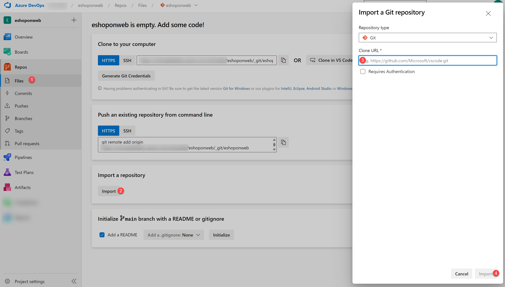

---
lab:
  title: Package Management with Azure Artifacts
  module: 'Module 07: Design and implement a dependency management strategy'
---

# Package Management with Azure Artifacts

## Requisitos do laboratório

- Este laboratório requer o **Microsoft Edge** ou um [navegador com suporte do Azure DevOps](https://docs.microsoft.com/azure/devops/server/compatibility).

- **Configurar uma organização do Azure DevOps:** se você ainda não tiver uma organização do Azure DevOps que possa usar para este laboratório, crie uma seguindo as instruções disponíveis em [Pré-requisitos do laboratório AZ-400](https://microsoftlearning.github.io/AZ400-DesigningandImplementingMicrosoftDevOpsSolutions/Instructions/Labs/AZ400_M00_Validate_lab_environment.html).

- **Configure o projeto eShopOnWeb de exemplo:** Se você ainda não tiver o projeto eShopOnWeb de exemplo que poderá usar neste laboratório, crie um seguindo as instruções disponíveis em [Pré-requisitos do Laboratório AZ-400](https://microsoftlearning.github.io/AZ400-DesigningandImplementingMicrosoftDevOpsSolutions/Instructions/Labs/AZ400_M00_Validate_lab_environment.html).

- O Visual Studio 2022 Community Edition está disponível na [página de Downloads do Visual Studio](https://visualstudio.microsoft.com/downloads/). A instalação do Visual Studio 2022 deve incluir as cargas de trabalho **ASP<nolink>.NET e desenvolvimento da Web**, **desenvolvimento do Azure** e **desenvolvimento entre plataformas do .NET Core**.

- **SDK do .NET Core:** [Baixe e instale o SDK do .NET Core (2.1.400+)](https://go.microsoft.com/fwlink/?linkid=2103972)

- **Provedor de credenciais do Azure Artifacts:** [Baixe e instale o provedor de credenciais](https://go.microsoft.com/fwlink/?linkid=2099625).

## Visão geral do laboratório

O Azure Artifacts facilita a descoberta, a instalação e a publicação de pacotes NuGet, npm e Maven no Azure DevOps. Está profundamente integrado com outros recursos do Azure DevOps, como Compilação, tornando o gerenciamento de pacotes uma parte perfeita de seus fluxos de trabalho existentes.

## Objetivos

Após concluir este laboratório, você poderá:

- Criar e se conectar a um feed.
- Criar e publicar um pacote NuGet.
- Importar um pacote NuGet.
- Atualizar um pacote NuGet.

## Tempo estimado: 35 minutos

## Instruções

### Exercício 0: configurar os pré-requisitos do laboratório

Neste exercício, você configurará os pré-requisitos para o laboratório.

#### Tarefa 1: (pular se feita) criar e configurar o projeto de equipe

Nesta tarefa, você criará um projeto **eShopOnWeb** do Azure DevOps para ser usado por vários laboratórios.

1. No computador do laboratório, em uma janela do navegador, abra sua organização do Azure DevOps. Clique em **Novo projeto**. Dê ao seu projeto o nome **eShopOnWeb** e deixe os outros campos com padrões. Clique em **Criar**.

   

#### Tarefa 2: (pular se feita) importar repositório do Git eShopOnWeb

Nesta tarefa, você importará o repositório eShopOnWeb do Git que será usado por vários laboratórios.

1. No computador do laboratório, em uma janela do navegador, abra sua organização do Azure DevOps e o projeto **eShopOnWeb** criado anteriormente. Clique em **Repos > Arquivos**, **Importar um repositório**. Selecione **Importar**. Na janela **Importar um repositório do Git**, cole a seguinte URL <https://github.com/MicrosoftLearning/eShopOnWeb.git> e clique em **Importar**:

   

1. O repositório está organizado da seguinte forma:
   - A pasta **.ado** contém os pipelines YAML do Azure DevOps.
   - O contêiner da pasta **.devcontainer** está configurado para o desenvolvimento usando contêineres (localmente no VS Code ou no GitHub Codespaces).
   - A pasta **infra** contém a infraestrutura Bicep e ARM como modelos de código usados em alguns cenários de laboratório.
   - A pasta **.github** contém definições de fluxo de trabalho YAML do GitHub.
   - A pasta **src** contém o site do .NET 8 usado em cenários de laboratório.

#### Tarefa 3: (pular se feita) definir o branch main como branch padrão

1. Vá para **Repos > Branches**.
1. Passe o mouse sobre o branch **main** e clique nas reticências à direita da coluna.
1. Clique em **Definir como branch padrão**.

#### Tarefa 4: Configurar a solução eShopOnWeb no Visual Studio

Nesta tarefa, você configurará o Visual Studio para se preparar para o laboratório.

1. Certifique-se de que você esteja exibindo o projeto de equipe do **eShopOnWeb** no portal do Azure DevOps.

   > **Observação**: Você pode acessar a página do projeto diretamente navegando até a URL [https://dev.azure.com/`<your-Azure-DevOps-account-name>`/eShopOnWeb](https://dev.azure.com/`<your-Azure-DevOps-account-name>`/eShopOnWeb), em que o espaço reservado `<your-Azure-DevOps-account-name>` representa o nome da organização do Azure DevOps.

1. No menu vertical no lado esquerdo do painel **eShopOnWeb**, clique em **Repos**.
1. No painel **Arquivos**, clique em **Clonar**, selecione a seta suspensa ao lado de **Clonar no VS Code** e, no menu suspenso, selecione **Visual Studio**.
1. Se for perguntado se deseja continuar, clique em **Abrir**.
1. Se solicitado, entre com a conta de usuário que você usou para configurar sua organização do Azure DevOps.
1. Na interface do Visual Studio, na janela pop-up do **Azure DevOps**, aceite o caminho local padrão (C:\eShopOnWeb) e clique em **Clonar**. Isso importará automaticamente o projeto para o Visual Studio.
1. Deixe a janela do Visual Studio aberta para usar em seu laboratório.

### Exercício 1: trabalhar com o Azure Artifacts

Neste exercício, você aprenderá a trabalhar com o Azure Artifacts usando as seguintes etapas:

- Criar e se conectar a um feed.
- Criar e publicar um pacote NuGet.
- Importar um pacote NuGet.
- Atualizar um pacote NuGet.

#### Tarefa 1: criar e conectar-se a um feed

Nesta tarefa, você criará e se conectará a um feed.

1. Na janela do navegador da Web que exibe suas configurações de projeto no portal do Azure DevOps, no painel de navegação vertical, selecione **Artefatos**.
1. Com o hub **Artefatos** exibido, clique em **+ Criar feed** na parte superior do painel.

   > **Observação**: esse feed será uma coleção de pacotes do NuGet disponíveis para usuários dentro da organização e ficará ao lado do feed do NuGet público como um par. O cenário neste laboratório se concentrará no fluxo de trabalho para usar o Azure Artifacts, portanto, as decisões de arquitetura e desenvolvimento são meramente ilustrativas. Esse feed incluirá funcionalidades comuns que podem ser compartilhadas entre projetos nesta organização.

1. No painel **Criar novo feed**, na caixa de texto **Nome**, digite **`eShopOnWebShared`**. Na seção **Visibilidade**, selecione Pessoas específicas e, na seção **Escopo**, selecione a opção **Project:eShopOnWeb**, deixe outras configurações com os valores padrão e clique em **Criar**.

   > **Observação**: qualquer usuário que queira se conectar a esse feed do NuGet deve configurar seu ambiente.

1. De volta ao hub **Artefatos**, clique em **Conectar ao feed**.
1. No painel **Conectar ao feed**, na seção **NuGet**, selecione **Visual Studio** e, no painel **Visual Studio**, copie a URL de **Origem**. `https://pkgs.dev.azure.com/Azure-DevOps-Org-Name/_packaging/eShopOnWebShared/nuget/v3/index.json`
1. Volte para a janela do **Visual Studio**.
1. Na janela do Visual Studio, clique no cabeçalho do menu **Ferramentas**. No menu suspenso, selecione **Gerenciador de Pacotes NuGet** e, no menu em cascata, selecione **Configurações do Gerenciador de Pacotes**.
1. Na caixa de diálogo **Opções**, clique em **Origens dos pacotes** e clique no sinal de adição para adicionar uma nova origem de pacote.
1. Na parte inferior da caixa de diálogo, na caixa de texto **Nome**, substitua a **Origem do pacote** por **eShopOnWebShared** e, na caixa de texto **Origem**, cole a URL copiada no portal do Azure DevOps. 
1. Clique em **Atualizar** e em **OK** para finalizar a adição.

   > **Observação**: o Visual Studio agora está conectado ao novo feed.

#### Tarefa 2: criar e publicar um pacote NuGet desenvolvido internamente

Nesta tarefa, você criará e publicará um pacote NuGet personalizado desenvolvido internamente.

1. Na janela do Visual Studio usada para configurar a nova origem do pacote, no menu principal, clique em **Arquivo**. No menu suspenso, clique em **Novo** e, em seguida, no menu em cascata, clique em **Projeto**.

   > **Observação**: agora criaremos um assembly compartilhado que será publicado como um pacote NuGet para que outras equipes possam integrá-lo e manter-se atualizadas sem precisar trabalhar diretamente com a origem do projeto.

1. No painel **Criar um novo projeto**, use a caixa de pesquisa para localizar o modelo de **Biblioteca de classes**, selecione o modelo para C# que tem como alvo o .NET ou .NET Standard, e clique em **Avançar**.
1. Na página **Biblioteca de Classes** do painel **Criar um novo projeto**, especifique as seguintes configurações e clique em **Criar**:

   | Configuração       | Valor                    |
   | ------------- | ------------------------ |
   | Nome do projeto  | **eShopOnWeb.Shared**    |
   | Localização      | aceitar o valor padrão |
   | Solução      | **Criar nova solução**  |
   | Solução nome | **eShopOnWeb.Shared**    |

   Marque a caixa de seleção para **colocar a solução e o projeto no mesmo diretório**.

1. Clique em Avançar. Aceite o **.NET 8** como a opção do Framework.
1. Confirme a criação do projeto pressionando botão **Criar**.
1. Na interface do Visual Studio, no painel **Gerenciador de Soluções**, clique com o botão direito do mouse em **Class1.cs**. No menu de contexto, selecione **Excluir** e, quando for solicitada a confirmação, clique em **OK.**
1. Pressione **Ctrl+Shift+B** ou **Clique com o botão direito do mouse no projeto EShopOnWeb.Shared** e selecione **Compilar** para compilar o projeto.
1. Na estação de trabalho de laboratório, abra o menu Iniciar e procure **Windows PowerShell**. Em seguida, no menu em cascata, clique em **Abrir o Windows PowerShell como administrador**.
1. **No Administrador: Janela do Windows PowerShell**, navegue até a pasta eShopOnWeb.Shared executando o seguinte comando:

   ```powershell
   cd c:\eShopOnWeb\eShopOnWeb.Shared
   ```

   > **Observação**: A pasta **eShopOnWeb.Shared** é o local do arquivo **eShopOnWeb.Shared.csproj**. Se você escolheu um local ou nome de projeto diferente, navegue até esse local.

1. Execute o seguinte para criar um arquivo **.nupkg** no projeto (altere o valor do espaço reservado `XXXXXX` com uma cadeia de caracteres exclusiva).

   ```powershell
   dotnet pack .\eShopOnWeb.Shared.csproj -p:PackageId=eShopOnWeb-XXXXXX.Shared
   ```

   > **Observação**: O comando **dotnet pack** cria o projeto e cria um pacote NuGet na pasta **bin\Release**. Se você não tiver uma pasta **Versão**, poderá usar a pasta **Depurar**.

   > **Observação**: desconsidere quaisquer avisos exibidos na janela **Administrador: Windows PowerShell**.

   > **Observação**: o dotnet pack cria um pacote mínimo com base nas informações que ele pode identificar do projeto. O argumento `-p:PackageId=eShopOnWeb-XXXXXX.Shared` permite que você crie um pacote com um nome específico usando o nome contido no projeto. Por exemplo, se você substituir a cadeia de caracteres `12345` pelo espaço reservado `XXXXXX`, o nome do pacote será **eShopOnWeb-12345.Shared.1.0.0.nupkg**. O número de versão foi recuperado do assembly.

1. Na janela do PowerShell, execute o seguinte comando para abrir a pasta **bin\Release**:

   ```powershell
   cd .\bin\Release
   ```

1. Execute o seguinte para publicar o pacote no feed **eShopOnWebShared**. Substitua a origem pela URL que você copiou anteriormente da URL de **origem** do Visual Studio `https://pkgs.dev.azure.com/Azure-DevOps-Org-Name/_packaging/eShopOnWebShared/nuget/v3/index.json`

   ```powershell
   dotnet nuget push --source "https://pkgs.dev.azure.com/Azure-DevOps-Org-Name/_packaging/eShopOnWebShared/nuget/v3/index.json" --api-key az "eShopOnWeb-XXXXXX.Shared.1.0.0.nupkg"
   ```

   > **Importante**: Se você receber um erro de autorização (401 Não autorizado), será necessário instalar o provedor de credenciais para o seu sistema operacional para poder autenticar-se com o Azure DevOps. Você pode encontrar as instruções de instalação no [Provedor de credenciais do Azure Artifacts](https://go.microsoft.com/fwlink/?linkid=2099625). Você pode fazer a instalação executando o seguinte comando na janela do PowerShell: `iex "& { $(irm https://aka.ms/install-artifacts-credprovider.ps1) } -AddNetfx"`

   > **Observação**: você precisa fornecer uma **chave de API**, que pode ser qualquer cadeia de caracteres não vazia. Estamos usando **az** aqui. Quando solicitado, entre na sua organização do Azure DevOps.

   > **Observação**: se o prompt não aparecer ou você receber o aviso **Aviso: o provedor de credenciais do plug-in não pôde adquirir as credenciais. A autenticação pode exigir ação manual. Considere executar novamente o comando com --interactive para `dotnet`, /p:NuGetInteractive=true para o MSBuild ou remover a opção -NonInteractive para NuGet",** você pode adicionar o parâmetro **--interactive** ao comando.

1. Aguarde a confirmação da operação de envio de pacote bem-sucedida.
1. Alterne para a janela do navegador da Web que exibe o portal do Azure DevOps e, no painel de navegação vertical, selecione **Artefatos**.
1. No painel do hub **Artefatos**, clique na lista suspensa no canto superior esquerdo e, na lista de feeds, selecione a entrada **eShopOnWebShared**.

   > **Observação**: O feed **eShopOnWebShared** deve incluir o pacote NuGet publicado recentemente.

1. Clique no pacote NuGet para exibir os detalhes.

#### Tarefa 3: importar um pacote NuGet de código aberto para o feed de pacotes do Azure DevOps

Além de desenvolver seus próprios pacotes, por que não usar a biblioteca de pacotes DotNet do NuGet de Código Aberto (<https://www.nuget.org>)? Com alguns milhões de pacotes disponíveis, sempre haverá algo útil para o seu aplicativo.

Nesta tarefa, usaremos um pacote de exemplo genérico "Newtonsoft.Json", mas você pode usar a mesma abordagem para outros pacotes na biblioteca.

1. Na mesma janela do PowerShell usada na tarefa anterior para enviar por push o novo pacote, navegue até a pasta **eShopOnWeb.Shared** (`cd ../..`) e execute o seguinte comando **dotnet** para instalar o pacote de exemplo:

   ```powershell
   dotnet add package Newtonsoft.Json
   ```

1. Verifique a saída do processo de instalação. Ele mostra os diferentes feeds dos quais tentará baixar o pacote:

   ```powershell
   Feeds used:
     https://api.nuget.org/v3/registration5-gz-semver2/newtonsoft.json/index.json
     https://pkgs.dev.azure.com/<AZURE_DEVOPS_ORGANIZATION>/eShopOnWeb/_packaging/eShopOnWebShared/nuget/v3/index.json
   ```

1. Em seguida, ele mostrará uma saída adicional em relação ao processo de instalação em si.

   ```powershell
   Determining projects to restore...
   Writing C:\Users\AppData\Local\Temp\tmpxnq5ql.tmp
   info : X.509 certificate chain validation will use the default trust store selected by .NET for code signing.
   info : X.509 certificate chain validation will use the default trust store selected by .NET for timestamping.
   info : Adding PackageReference for package 'Newtonsoft.Json' into project 'c:\eShopOnWeb\eShopOnWeb.Shared\eShopOnWeb.Shared.csproj'.
   info :   GET https://api.nuget.org/v3/registration5-gz-semver2/newtonsoft.json/index.json
   info :   OK https://api.nuget.org/v3/registration5-gz-semver2/newtonsoft.json/index.json 124ms
   info : Restoring packages for c:\eShopOnWeb\eShopOnWeb.Shared\eShopOnWeb.Shared.csproj...
   info :   GET https://api.nuget.org/v3/vulnerabilities/index.json
   info :   OK https://api.nuget.org/v3/vulnerabilities/index.json 84ms
   info :   GET https://api.nuget.org/v3-vulnerabilities/2024.02.15.23.23.24/vulnerability.base.json
   info :   GET https://api.nuget.org/v3-vulnerabilities/2024.02.15.23.23.24/2024.02.17.11.23.35/vulnerability.update.json
   info :   OK https://api.nuget.org/v3-vulnerabilities/2024.02.15.23.23.24/vulnerability.base.json 14ms
   info :   OK https://api.nuget.org/v3-vulnerabilities/2024.02.15.23.23.24/2024.02.17.11.23.35/vulnerability.update.json 30ms
   info : Package 'Newtonsoft.Json' is compatible with all the specified frameworks in project 'c:\eShopOnWeb\eShopOnWeb.Shared\eShopOnWeb.Shared.csproj'.
   info : PackageReference for package 'Newtonsoft.Json' version '13.0.3' added to file 'c:\eShopOnWeb\eShopOnWeb.Shared\eShopOnWeb.Shared.csproj'.
   info : Writing assets file to disk. Path: c:\eShopOnWeb\eShopOnWeb.Shared\obj\project.assets.json
   log  : Restored c:\eShopOnWeb\eShopOnWeb.Shared\eShopOnWeb.Shared.csproj (in 294 ms).
   ```

1. O pacote Newtonsoft.Json foi instalado nos Pacotes como **Newtonsoft.Json**. No **Gerenciador de Soluções** do Visual Studio, navegue até o projeto **eShopOnWeb.Shared**, expanda Dependências e observe o **Newtonsoft.Json** nos Pacotes. Clique na pequena seta à esquerda dos pacotes para abrir a pasta e a lista de arquivos.

Quando você criou o Feed de Pacotes de Artefatos do Azure DevOps, por padrão, ele permite **fontes upstream**, como nuget.org no exemplo dotnet que traz o pacote Newtonsoft.Json de onde o pacote está hospedado. Esta é uma prática comum para evitar a duplicação de pacotes e para garantir que a versão mais recente seja sempre usada.

1. No Portal do Azure DevOps, **atualize** a página Feed de Pacotes de Artefatos. A lista de pacotes mostra o pacote personalizado **eShopOnWeb.Shared**, bem como o pacote de origem pública **Newtonsoft.Json**.
1. Na solução do Visual Studio **eShopOnWeb.Shared**, clique com o botão direito do mouse no projeto **eShopOnWeb.Shared** e selecione **Gerenciar pacotes NuGet** no menu de contexto.
1. Na janela do Gerenciador de pacotes NuGet, valide se a **origem do pacote** está definida como **eShopOnWebShared**.
1. Clique em **Procurar** e aguarde até que a lista de Pacotes NuGet seja carregada.
1. Essa lista também mostrará o pacote de desenvolvimento personalizado **eShopOnWeb.Shared**, bem como o pacote de origem pública **Newtonsoft.Json**.

## Revisão

Neste laboratório, você aprendeu a trabalhar com o Azure Artifacts usando as seguintes etapas:

- Criar e se conectar a um feed.
- Criar e publicar um pacote NuGet.
- Importar um pacote NuGet personalizado.
