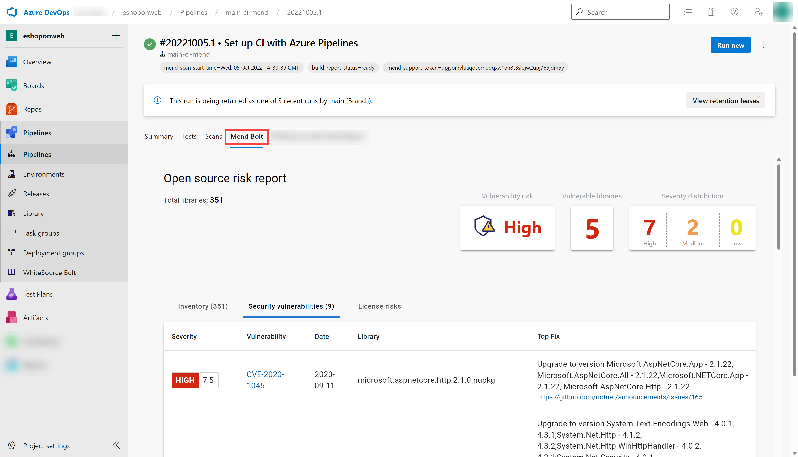

---
lab:
  title: Implementar segurança e conformidade em um pipeline do Azure DevOps
  module: 'Module 07: Implement security and validate code bases for compliance'
---

# Implementar segurança e conformidade em um pipeline do Azure DevOps

# Manual de laboratório do aluno

## Requisitos do laboratório

- Este laboratório requer o **Microsoft Edge** ou um [navegador compatível com o Azure DevOps.](https://learn.microsoft.com/azure/devops/server/compatibility?view=azure-devops#web-portal-supported-browsers)

- **Configurar uma organização do Azure DevOps:** se você ainda não tiver uma organização Azure DevOps que possa usar para este laboratório, crie uma seguindo as instruções disponíveis em [Criar uma organização ou coleção de projetos](https://learn.microsoft.com/azure/devops/organizations/accounts/create-organization?view=azure-devops).

## Visão geral do laboratório

Neste laboratório, você usará o **Mend Bolt (antigo WhiteSource)** para detectar automaticamente componentes de código aberto vulneráveis, bibliotecas desatualizadas e problemas de conformidade de licença no código. Você aproveitará o WebGoat, um aplicativo da Web intencionalmente inseguro mantido pelo OWASP, projetado para ilustrar problemas comuns de segurança de aplicativos da Web.

A [Mend](https://www.mend.io/) é líder em segurança contínua de software de código aberto e gerenciamento de conformidade. O WhiteSource se integra ao seu processo de construção, independentemente de suas linguagens de programação, ferramentas de construção ou ambientes de desenvolvimento. Ele funciona de forma automática, contínua e silenciosa em segundo plano, verificando a segurança, licenciamento e qualidade de seus componentes de código aberto em relação ao banco de dados definitivo atualizado constantemente de repositórios de código aberto do WhiteSource.

A Mend fornece o Mend Bolt, uma solução leve de gerenciamento e segurança de código aberto desenvolvida especificamente para integração com o Azure DevOps e o Azure DevOps Server. Note que o Mend Bolt trabalha por projeto e não oferece recursos de alerta em tempo real, que exigem uma **Plataforma completa**, ele é recomendado para equipes de desenvolvimento maiores, que desejam automatizar seu gerenciamento de código aberto em todo o ciclo de vida de desenvolvimento de software (dos repositórios aos estágios de pós-implantação) e em todos os projetos e produtos.

A integração do Azure DevOps com o Mend Bolt permitirá que você:

- Detecte e corrija componentes de código aberto vulneráveis.
- Gere relatórios abrangentes de inventário de código aberto por projeto ou compilação.
- Reforce a conformidade com licenças de código aberto, incluindo licenças de dependências.
- Identifique bibliotecas de código aberto desatualizadas com recomendações para atualização.

## Objetivos

Após concluir este laboratório, você poderá:

- Habilitar o Mend Bolt
- Executar um pipeline de build e revisar o relatório de segurança e conformidade do Mend

## Tempo estimado: 45 minutos

## Instruções

### Exercício 0: configurar os pré-requisitos do laboratório

Neste exercício, você configurará os pré-requisitos para o laboratório, que consistem em um novo projeto do Azure DevOps com um repositório baseado no [eShopOnWeb](https://github.com/MicrosoftLearning/eShopOnWeb).

#### Tarefa 1: (ignorar se concluído) criar e configurar o projeto de equipe

Nesta tarefa, você criará um projeto do Azure DevOps no **eShopOnWeb** para ser usado por vários laboratórios.

1.  No computador do laboratório, em uma janela do navegador, abra sua organização do Azure DevOps. Clique em **Novo projeto**. Dê ao seu projeto o nome **eShopOnWeb** e deixe os outros campos com padrões. Clique em **Criar**.

    

#### Tarefa 2: (ignorar se concluído) importar repositório Git do eShopOnWeb

Nesta tarefa, você importará o repositório Git do eShopOnWeb que será usado por vários laboratórios.

1.  No computador do laboratório, em uma janela do navegador, abra sua organização do Azure DevOps e o projeto criado anteriormente do **eShopOnWeb**. Clique em **Repos>Files**, **Importar**. Na janela, **Importar um repositório Git**, cole a seguinte URL https://github.com/MicrosoftLearning/eShopOnWeb.git e clique em **Importar**:

    

1.  O repositório está organizado da seguinte forma:
    - A pasta **.ado** contém os pipelines YAML do Azure DevOps
    - O contêiner da pasta **.devcontainer** está configurado para o desenvolvimento usando contêineres (localmente no VS Code ou no GitHub Codespaces)
    - A pasta **.azure** contém a infraestrutura Bicep&ARM como modelos de código usados em alguns cenários do laboratório.
    - A pasta **.github** contém definições de fluxo de trabalho YAML do GitHub.
    - A pasta **src** contém o site .NET 6 usado nos cenários do laboratório.

### Exercício 1: Implementar a segurança e a conformidade em um pipeline do Azure DevOps usando o Mend Bolt

Neste exercício, aproveite o Mend Bolt para verificar o código do projeto em busca de vulnerabilidades de segurança e problemas de conformidade de licenciamento e exibir o relatório resultante.

#### Tarefa 1: ativar a extensão Mend Bolt

Nesta tarefa, você ativará o WhiteSource Bolt no projeto recém-gerado do Azure Devops.

1.  No computador do laboratório, na janela do navegador da Web que exibe o portal do Azure DevOps, com o projeto **eShopOnWeb** aberto, clique no ícone do marketplace **Navegar no marketplace**.

    

1.  No MarketPlace, procure por **Mend Bolt (anteriormente WhiteSource)** e abra-o. Mend Bolt é a versão gratuita da ferramenta anteriormente conhecida como WhiteSource, que verifica todos os projetos e detecta componentes de código aberto, a licença e as vulnerabilidades conhecidas deles.

    > Atenção: certifique-se de selecionar a opção Mend **Bolt** (a **gratuita**)!

1.  Na página **Mend Bolt (anteriormente WhiteSource),** clique em **Obter grátis**.

    

1.  Na próxima página, selecione a organização do Azure DevOps desejada e clique em **Instalar**. **Prossiga para a organização** depois de instalado.

1.  No Azure DevOps, navegue até **Configurações da organização** e selecione **Mend** em **Extensões**. Forneça seu email de trabalho (**sua conta pessoal de laboratório**, por exemplo, usando AZ400learner@outlook.com em vez de student@microsoft.com), Nome da empresa e outros detalhes e clique no botão **Criar conta** para começar a usar a versão gratuita.

    

#### Tarefa 2: criar e acionar uma compilação

Nesta tarefa, você criará e acionará um pipeline de build de CI no projeto do Azure DevOps. Você usará a extensão **Mend Bolt** para identificar componentes de OSS vulneráveis presentes neste código.

1.  No computador do laboratório, no projeto **eShopOnWeb** no Azure DevOps, na barra de menus vertical no lado esquerdo, navegue até a seção **Pipelines>Pipelines**, clique em **Criar Pipeline** (ou **Novo Pipeline**).

1.  Na janela **Onde está seu código?**, selecione **Git do Azure Repos (YAML)** e selecione o repositório **eShopOnWeb**.

1.  Na seção **Configurar**, escolha **Arquivo YAML existente do Azure Pipelines**. Forneça o seguinte caminho **/.ado/eshoponWeb-ci-mend.yml** e clique em **Continuar**.

    

1.  Revise o pipeline e clique em **Executar**. Levará apenas alguns minutos para ser executado com sucesso.
    > **Observação**: a compilação pode levar alguns minutos para ser concluída. A definição de build é composta pelas seguintes tarefas:
    - Tarefa **DotnetCLI** para restaurar, construir, testar e publicar o projeto dotnet.
    - Tarefa **Whitesource** (ainda mantém o nome antigo), para executar a análise da ferramenta Mend de bibliotecas OSS.
    - **Publicar artefatos** Os agentes que executam esse pipeline carregarão o projeto da Web publicado.

1.  Enquanto o pipeline está em execução, vamos **renomeá-lo** para identificá-lo com mais facilidade (já que o projeto pode ser usado para vários laboratórios). Vá para a seção ** Pipelines/Pipelines** no projeto do Azure DevOps, clique no nome do pipeline em execução (ele receberá um nome padrão) e procure a opção **Renomear/mover** no ícone de reticências. Renomeie-o para **eshoponWeb-ci-mend** e clique em **Salvar**.

    

1.  Depois que a execução de pipeline for concluída, você poderá revisar os resultados. Abra a execução mais recente para o pipeline **eshoponWeb-ci-mend**. A guia de resumo mostrará os logs da execução, juntamente com detalhes relacionados, como a versão do repositório (confirmação) usada, tipo de gatilho, artefatos publicados, cobertura de teste, etc.

1. Na guia **Mend Bolt**, você pode revisar a análise de segurança do OSS. Ela mostrará detalhes sobre o inventário usado, vulnerabilidades encontradas (e como resolvê-las) e um relatório interessante sobre licenças relacionadas à biblioteca. Reserve algum tempo para analisar o relatório.

    

## Revisão

Neste laboratório, você usará o **Mend Bolt com o Azure DevOps** para detectar automaticamente componentes de código aberto vulneráveis, bibliotecas desatualizadas e problemas de conformidade de licença em seu código.
