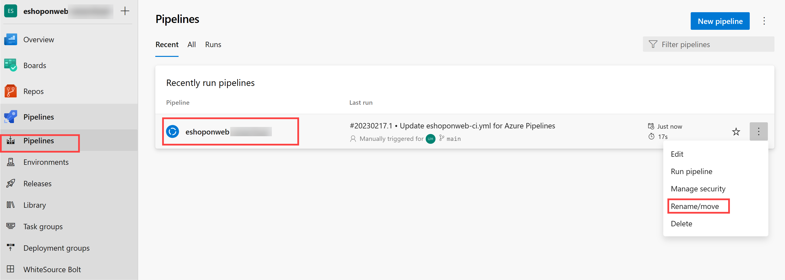
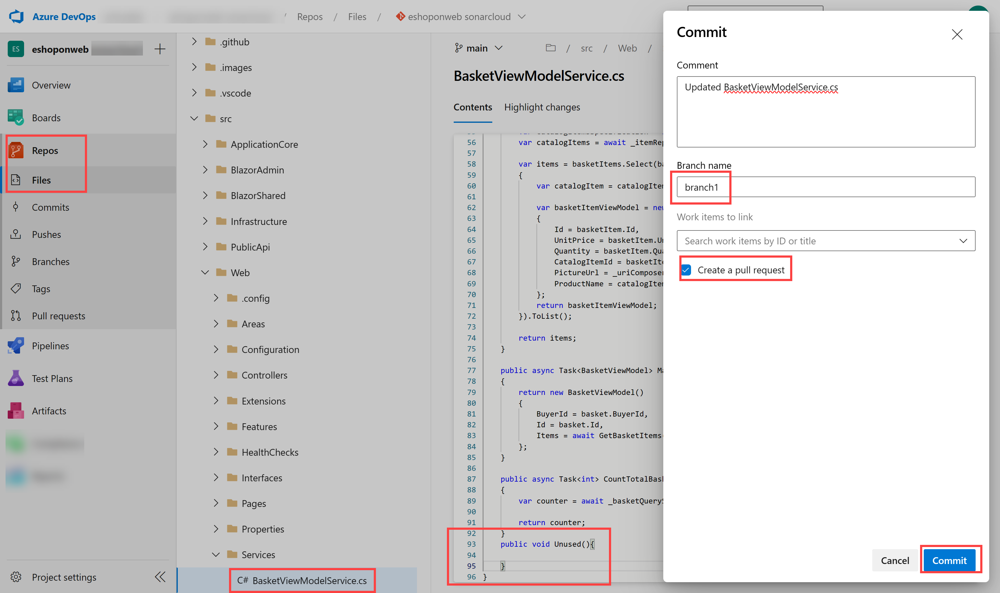

---
lab:
  title: Gerenciar dívidas técnicas com o SonarQube e o Azure DevOps
  module: 'Module 07: Implement security and validate code bases for compliance'
---

# Gerenciar dívidas técnicas com o SonarQube e o Azure DevOps

# Manual de laboratório do aluno

## Requisitos do laboratório

- Este laboratório requer o **Microsoft Edge** ou um [navegador compatível com o Azure DevOps.](https://docs.microsoft.com/en-us/azure/devops/server/compatibility?view=azure-devops#web-portal-supported-browsers)

- **Configurar uma organização do Azure DevOps:** se você ainda não tiver uma organização Azure DevOps que possa usar para este laboratório, crie uma seguindo as instruções disponíveis em [Criar uma organização ou coleção de projetos](https://docs.microsoft.com/en-us/azure/devops/organizations/accounts/create-organization?view=azure-devops).

## Visão geral do laboratório

No contexto do Azure DevOps, o termo **dívida técnica** representa os meios menos eficientes usados para atingir metas táticas, os quais prejudicam a capacidade de atingir objetivos estratégicos no desenvolvimento e implantação de software. A dívida técnica afeta a produtividade, tornando o código difícil de entender, propenso a falhas, demorado para mudar e difícil de validar. Sem supervisão e gerenciamento adequados, a dívida técnica pode se acumular ao longo do tempo e afetar significativamente a qualidade geral do software e a produtividade das equipes de desenvolvimento a longo prazo.

O [SonarCloud](https://sonarcloud.io/){:target="\_blank"} é um serviço de segurança e qualidade de código baseado em nuvem. Os principais recursos do SonarCloud incluem:

- Suporte para 23 linguagens de programação e script, incluindo Java, JS, C#, C/C++, Objective-C, TypeScript, Python, ABAP, PLSQL e T-SQL.
- Há milhares de regras para rastrear bugs difíceis de encontrar e problemas de qualidade com base em analisadores avançados de código estático.
- Integrações baseadas em nuvem com serviços de CI populares, incluindo Travis, Azure DevOps, BitBucket e AppVeyor.
- Análise profunda de código para explorar todos os arquivos de origem em branches e solicitações de pull, ajudando a alcançar um Quality Gate confiável e promover a compilação.
- Velocidade e escalabilidade.

Neste laboratório, você aprenderá a integrar o Azure DevOps ao SonarCloud.

> **Observação**: antes de realizar este laboratório, verifique se você tem capacidade de executar o Azure Pipelines. Devido à alteração dos projetos públicos ocorrida em fevereiro de 2021, será necessário solicitar o acesso aos pipelines: <https://devblogs.microsoft.com/devops/change-in-azure-pipelines-grant-for-public-projects/>

## Objetivos

Após concluir este laboratório, você poderá:

- Configurar um projeto do Azure DevOps e uma compilação de CI para integração com o SonarCloud.
- Analisar relatórios do SonarCloud.
- Integrar a análise estática ao processo de solicitação de pull do Azure DevOps.

## Tempo estimado: 60 minutos

## Instruções

### Exercício 0: configurar os pré-requisitos do laboratório

Neste exercício, você configurará os pré-requisitos para o laboratório, que consistem em um novo projeto do Azure DevOps com um repositório baseado no [eShopOnWeb](https://github.com/MicrosoftLearning/eShopOnWeb).

#### Tarefa 1: (ignorar se concluído) criar e configurar o projeto de equipe

Nesta tarefa, você criará um projeto do Azure DevOps no **eShopOnWeb** para ser usado por vários laboratórios.

1.  No computador do laboratório, em uma janela do navegador, abra sua organização do Azure DevOps. Clique em **Novo projeto**. Dê ao seu projeto o nome **eShopOnWeb** e escolha **Scrum** na lista suspensa **Processo de item de trabalho**. Clique em **Criar**.

    

#### Tarefa 2: (ignorar se concluído) importar repositório Git do eShopOnWeb

Nesta tarefa, você importará o repositório Git do eShopOnWeb que será usado por vários laboratórios.

1.  No computador do laboratório, em uma janela do navegador, abra sua organização do Azure DevOps e o projeto criado anteriormente do **eShopOnWeb**. Clique em **Repos>Files**, **Importar**. Na janela, **Importar um repositório Git**, cole a seguinte URL https://github.com/MicrosoftLearning/eShopOnWeb.git e clique em **Importar**:

    

1.  O repositório está organizado da seguinte forma:
    - A pasta **.ado** contém os pipelines YAML do Azure DevOps
    - O contêiner da pasta **.devcontainer** está configurado para o desenvolvimento usando contêineres (localmente no VS Code ou no GitHub Codespaces)
    - A pasta **.azure** contém a infraestrutura Bicep&ARM como modelos de código usados em alguns cenários do laboratório.
    - A pasta **.github** contém definições de fluxo de trabalho YAML do GitHub.
    - A pasta **src** contém o site .NET 6 usado nos cenários do laboratório.

### Exercício 1: configurar a instalação do Sonarcloud

#### Tarefa 1: mudar seu projeto do Azure DevOps para público

Nesta tarefa, você mudará a visibilidade do seu projeto do Azure DevOps para pública, pois o Sonarcloud é gratuito para projetos ADO públicos.

1. 1. No computador do laboratório, na janela do navegador da Web que exibe o portal do Azure DevOps, abra seu projeto **eShopOnWeb** e clique em **Configurações do projeto** (canto inferior esquerdo). Mude a **Visibilidade** para **Pública**. Clique em **Salvar**


#### Tarefa 2: gerar um token de acesso pessoal do Azure DevOps

Nesta tarefa, você gerará um token de acesso pessoal do Azure DevOps que será usado para autenticar a partir do aplicativo Postman que você instalará na próxima tarefa deste exercício.

1. No computador do laboratório, na janela do navegador da Web que exibe o portal do Azure DevOps, no canto superior direito da página do Azure DevOps, clique no ícone **Configurações do usuário**, no menu suspenso, clique em **Tokens de acesso pessoal**, no painel **Tokens de acesso pessoal** e clique em **+ Novo Token**.

    

1. No painel **Criar um novo token de acesso pessoal**, clique no link **Mostrar todos os escopos** e especifique as seguintes configurações e clique em **Criar** (deixe todos os outros com seus valores padrão):

     | Configuração | Valor |
     | --- | --- |
     | Nome | ** Laboratório Gerenciar dívidas técnicas com o SonarQube e o Azure DevOps** |
     | Escopos | **Definido como personalizado** |
     | Escopo | **Código** |
     | Permissões | **Full** |

1. No painel **Sucess**, copie o valor do token de acesso pessoal para a área de transferência.

     > **Observação**: certifique-se de registrar o valor do token. Você não poderá recuperá-lo depois de fechar este painel.

1. No painel **Success** , clique em **Fechar**.

#### Tarefa 3: instalar e configurar a extensão SonarCloud do Azure DevOps

Nesta tarefa, você instalará e configurará a extensão SonarCloud de Azure DevOps em seu projeto do Azure DevOps.

1. No computador do laboratório, inicie um navegador da Web, navegue até a [página da extensão SonarCloud](https://marketplace.visualstudio.com/items?itemName=SonarSource.sonarcloud) no Visual Studio Marketplace, clique em **Obter gratuitamente **, verifique se o nome da sua organização do Azure DevOps aparece na lista suspensa **Selecionar uma organização do Azure Devops** e clique em **Instalar**.
1. Quando a instalação for concluída, clique em **Continuar para a organização**. Isso redirecionará o navegador para o portal do Azure DevOps exibindo a página inicial da sua organização.

    > **Observação**: se você não tiver as permissões apropriadas para instalar uma extensão do marketplace, uma solicitação será enviada ao administrador da conta para solicitar que ele aprove a instalação.

    > **Observação**: a extensão SonarCloud contém tarefas de compilação, modelos de compilação e um widget de painel personalizado.

1. Na janela do navegador da Web, navegue até a **página inicial do SonarCloud** [https://sonarcloud.io/](https://sonarcloud.io/).
1. Na página inicial do SonarCloud, clique em **Login**.
1. Em **Fazer login ou se inscrever no SonarCloud**, clique na opção **Azure DevOps**.
1. Se for perguntado se deseja **Permitir que este aplicativo acesse suas informações?**, clique em **Sim**. Caso solicitado, selecione **Consentir em nome da sua organização** e **Aceitar**.

    > **Observação**: no SonarCloud, você criará uma organização e, dentro dela, um novo projeto. A organização e o projeto que você configurou no SonarCloud espelharão a organização e o projeto que você configurou no Azure DevOps.

1. Clique em **Importar uma organização do Azure**.

    

1. Na página **Criar uma organização**, na caixa de texto **Nome da organização do Azure DevOps**, digite o nome da sua organização do Azure DevOps, na caixa de texto **Token de acesso pessoal**, cole o valor do token do Azure DevOps registrado na tarefa anterior e clique em **Continuar**. **Esse token será usado pelo Sonarcloud para analisar seu código hospedado no Azure DevOps**

1. Na seção **Importar detalhes da organização**, na caixa de texto **Chave**, digite uma cadeia de caracteres que designará sua organização do Sonarcloud, dê a ela o mesmo nome que sua organização do Azure DevOps e clique em **Continuar**.

    > **Observação**: a chave deve ser exclusiva dentro do sistema SonarCloud. Verifique se a marca de seleção verde aparece à direita da caixa de texto **Chave**. Isso indica que a chave satisfaz o pré-requisito de exclusividade.

1. Na seção **Escolher um plano**, selecione o plano que você pretende usar para este laboratório (sugestão **gratuita**) e clique em **Criar organização**.

    > **Observação**: agora você criou a organização SonarCloud que espelha sua organização do Azure DevOps.

    > **Observação**: em seguida, dentro da organização recém-criada, você criará um projeto SonarCloud que espelhará o projeto **SonarExamples** do Azure DevOps.

1. Na página **Analisar projetos - Selecionar repositórios**, na lista de projetos do Azure DevOps, marque a caixa de seleção ao lado da entrada **eshoponWeb/eshoponWeb** e clique em **Configurar**.
1. Na página **Escolha seu método de análise**, clique no bloco **Com Pipelines do Azure DevOps**.

    

    > **Observação**: você pode ignorar a criação da extensão se já a tiver instalado.

1. Na página **Analisar um projeto com o Azure Pipelines**, em **Adicionar um novo ponto de extremidade do serviço Sonarcloud**, siga as etapas mencionadas **em seu projeto do Azure DevOps**, dê o nome **SonarSC** à conexão de serviço, **marque** a caixa para conceder acesso a todos os pipelines e clique em **Verificar e salvar**. 

    

    > **Observação**: esta etapa define como seu Azure Pipeline se comunicará com o Sonarcloud. O Sonarcloud fornecerá um token que é usado por seus pipelines para falar com o serviço. 

1.  No computador do laboratório, no projeto **eShopOnWeb** no Azure DevOps, na barra de menus vertical no lado esquerdo, navegue até a seção **Pipelines>Pipelines**, clique em **Criar Pipeline** (ou **Novo Pipeline**).

1.  Na janela **Onde está seu código?**, selecione **Git do Azure Repos (YAML)** e selecione o repositório **eShopOnWeb**.

1.  Na seção **Configurar**, escolha **Arquivo YAML existente do Azure Pipelines**. Forneça o seguinte caminho **/.ado/eshoponWeb-sonar-ci.yml** e clique em **Continuar**. Revise o pipeline com os detalhes mencionados na próxima etapa **(algumas configurações devem ser substituídas)**

1. De volta ao site do Sonarcloud, na página **Analisar um projeto com Azure Pipelines**, na seção **Configurar Azure Pipelines**, clique em **.NET**. Isso exibirá uma sequência de etapas necessárias para **Preparar a configuração da análise**, **Executar a análise de código** e **Publicar o resultado do Quality Gate**. Você precisará dessas instruções para **modificar a tarefa "Preparar configuração de análise" no pipeline YAML fornecido na etapa anterior**.

1. Depois que o pipeline tiver sido modificado, clique em **Executar**.

    

1. Talvez seja necessário alterar a **Visibilidade** do projeto do Azure DevOps de volta para **Particular** para que os agentes executem o pipeline (Configurações do Projeto > Visão Geral)

1. No Azure DevOps **Pipelines > Pipelines ** e clique no pipeline criado recentemente e renomeie-o para **eshoponWeb-sonar-ci**.

    

#### Tarefa 3: verificar os resultados do pipeline

Nesta tarefa, você verificará os resultados do pipeline.

1. Aguarde a conclusão da execução de pipeline, revise o conteúdo da guia **Resumo** e clique no cabeçalho da guia **Extensões**.

    > **Observação**: você não terá informações do Quality Gate (Nenhuma), porque ainda não o configuramos no Sonarcloud.

1. Na guia **Extensões**, clique no **relatório Detalhado do SonarCloud**. Isso abrirá automaticamente uma nova guia do navegador exibindo o relatório na página do projeto SonarCloud.

    > **Observação**: alternativamente, você pode navegar até o seu projeto SonarCloud.

1. Verifique se o relatório não inclui os resultados do Quality Gate e anote o motivo de sua ausência.

    > **Observação**: para poder ver o resultado do Quality Gate, depois de executar o primeiro relatório, precisamos definir uma **Nova definição de código**. Dessa forma, as execuções de pipeline seguintes incluirão os resultados do Quality Gate. **O Quality Gate padrão garantirá que não haja nenhuma nova vulnerabilidade/bug no código, ignorando os já existentes. Você pode criar seus próprios quality gates personalizados.**

1. Clique em **Configurar nova definição de código** e selecione **Versão anterior**.

    


1. Alterne para o navegador da Web no **portal do Azure DevOps** com a execução de compilação mais recente, clique em **Executar novo** e, no painel **Executar pipeline**, clique em **Executar**.
1. No painel de execução da compilação, revise o conteúdo da guia **Resumo** e clique no cabeçalho da guia **Extensões**.
1. Na guia **Extensões**, clique no **relatório Detalhado do SonarCloud**. Isso abrirá automaticamente uma nova guia do navegador exibindo o relatório na página do projeto SonarCloud.
1. Verifique se a guia relatório e **extensão** do Azure DevOps agora **inclui o resultado do Quality Gate**.

    

### Exercício 2: analisar relatórios do SonarCloud

Neste exercício, você analisará os relatórios do SonarCloud.

#### Tarefa 1: analisar relatórios do SonarCloud

Nesta tarefa, você analisará os relatórios do SonarCloud.

1. Na guia **Visão geral** do projeto SonarCloud, vemos um resumo para o relatório sobre a **evolução do branch principal**. Se você clicar no ícone da **Ramificação principal**(coluna esquerda) e escolher **Código geral**, verá um relatório mais detalhado.

    

    > **Observação**: a página tem métricas como **Code Smells**, **Cobertura**, **Duplicações** e **Tamanho** (linhas de código). A tabela a seguir explica resumidamente esses termos.

    | Terms | Descrição |
    | --- | --- |
    | **•s** | Um problema que representa um erro no código. Se isso ainda não quebrou, vai acontecer, e provavelmente no pior momento possível. Isso precisa ser corrigido |
    | **Vulnerabilidades** | Um problema relacionado à segurança que representa um potencial backdoor para invasores |
    | **Code smells** | Um problema relacionado à manutenção no código. Deixá-lo como está significa que, na melhor das hipóteses, os mantenedores terão mais dificuldade do que deveriam ao fazer mudanças posteriores. Na pior das hipóteses, eles ficarão tão confusos com o estado do código que introduzirão erros adicionais à medida que fizerem mudanças |
    | **Cobertura** | Uma indicação da porcentagem de código que está sendo validada por testes como testes de unidade. Para se proteger efetivamente contra bugs, os testes devem exercitar ou "cobrir" uma grande porção de seu código |
    | **Duplicações** | A decoração de duplicações mostra quais partes do código-fonte são duplicadas |
    | **Hotspots de segurança** | Código sensível à segurança que requer revisão manual para avaliar se existe ou não uma vulnerabilidade |


1. Clique no número que designa a contagem de **Bugs**. Isso exibirá automaticamente o conteúdo da guia **Problemas**.
1. No lado direito da guia **Problemas**, clique para abrir os bugs. Leia a descrição e as informações fornecidas para analisar e resolver o bug. 

1. Passe o ponteiro do mouse sobre as linhas vermelhas verticais entre o código e os números de linha para identificar lacunas na cobertura do código.

    > **Observação**: nosso projeto de exemplo é muito pequeno e não tem dados históricos. No entanto, existem milhares de [projetos públicos no SonarCloud](https://sonarcloud.io/explore/projects) que têm resultados mais interessantes e realistas.

### Exercício 3: implementar a integração de solicitação de pull do Azure DevOps com o SonarCloud

Neste exercício, você configurará a integração de solicitação de pull entre o Azure DevOps e o SonarCloud.

> **Observação**: para configurar a análise do SonarCloud para executar a análise do código incluído em uma solicitação de pull do Azure DevOps, você precisa executar as seguintes tarefas:

- Adicionar um token de acesso pessoal do Azure DevOps a um projeto SonarCloud, que autoriza seu acesso a solicitações de pull (já criadas neste laboratório).
- Configurar uma política de branch do Azure DevOps que controla uma compilação acionada por solicitação de pull

#### Tarefa 1: configurar a integração da solicitação de pull no SonarCloud

Nesta tarefa, você configurará a integração da solicitação de pull no SonarCloud atribuindo um token de acesso pessoal do Azure DevOps ao seu projeto SonarCloud.

1. Alterne para a janela do navegador da Web que está exibindo o projeto **eShopOnWeb** no **SonarCloud**.
1. Na página do painel do projeto, clique no ícone da guia **Administração** e, no menu suspenso, clique em **Configurações gerais**.
1. Na página **Configurações gerais**. clique em **Solicitações de pull**.
1. Na seção **Geral** das configurações das **Solicitações de pull**, na lista suspensa **Provedor**, selecione **Serviços do Azure DevOps** e clique em **Salvar**.
1. Na seção **Integração com os serviços do Azure DevOps** das configurações de **Solicitações de pull**, na caixa de texto **Token de acesso pessoal**, cole o token de acesso pessoal do Azure DevOps gerado anteriormente e clique em ** Salvar**

    

#### Tarefa 2: configurar uma política de branch para integração com o SonarCloud

Nesta tarefa, você configurará uma política de branch do Azure DevOps para integração com o SonarCloud.

1. Alterne para a janela do navegador exibindo o projeto **eShopOnWeb** no **portal do Azure DevOps**.
1. Na barra de menus vertical na extremidade esquerda do portal do Azure DevOps, clique em **Repos** e, na seção **Repos**, clique em **Branches**.
1. No painel **Branches**, na lista de branches, passe o mouse com o ponteiro do mouse sobre a borda direita da entrada de branch **principal** para revelar o caractere de reticências verticais que designa o menu **Mais opções**, clique nele e, no menu pop-up, clique em **Políticas de branch**.
1. No painel **principal**, à direita da seção **Validação de compilação**, clique em**+**.
1. No painel **Adicionar política de compilação**, na lista suspensa **Pipeline de build**, selecione o pipeline criado anteriormente neste laboratório, na caixa de texto **Nome de exibição**, digite **Análise do SonarCloud** e clique em **Salvar**.

    > **Observação**: o Azure DevOps agora está configurado para acionar uma análise do SonarCloud quando uma solicitação de pull direcionada à branch **principal** for criada.

#### Tarefa 4: validar a integração da solicitação de pull

Nesta tarefa, você validará a integração de solicitação de pull entre o Azure DevOps e o SonarCloud criando uma solicitação de pull e revisando a saída resultante.

> **Observação**: você fará uma mudança em um arquivo no repositório e criará uma solicitação para acionar a análise do SonarCloud.

1. No portal do Azure DevOps, na barra de menu vertical no lado esquerdo, clique em **Repositórios**. Isso exibirá o painel **Arquivos**.
1. No painel central, na hierarquia de pastas, navegue até o arquivo **Program.cs** na pasta **src/Web/Services/BasketViewModelService.cs** e clique em **Editar**.
1. No painel **BasketViewModelService.cs**, adicione o seguinte método vazio ao código diretamente antes do último "}":

    ```csharp
    public void Unused(){

    }
    ```

1. No painel **Program.cs**, clique em **Confirmar**.
1. No painel **Confirmar**, na caixa de texto **Nome do branch**, digite **branch1**, marque a caixa de seleção **Criar uma solicitação de pull** e clique em **Confirmar**.

    

1. No painel **Nova solicitação de pull**, selecione **Criar**.
1. Na guia **Visão geral** do painel **Updated Program.cs**, monitore o progresso do processo de compilação até sua conclusão. 
1. O pipeline será bem-sucedido, mas uma verificação opcional falhará.
1. O Sonarcloud também decorará sua PR com comentários para suas práticas recentes não recomendadas. Você também pode revisar o relatório completo no Sonarcloud para obter detalhes.

     


#### Tarefa 4: bloquear solicitações de pull em resposta a verificações não aprovadas na qualidade do código

Nesta tarefa, você configurará o bloqueio de solicitações de pull em resposta a verificações não aprovadas na qualidade do código.

> **Observação**: até este ponto, ainda é possível concluir a solicitação de pull e confirmar as mudanças correspondentes, mesmo que as verificações de Qualidade do código não sejam aprovadas. Você modificará a configuração do Azure DevOps para bloquear a confirmação, a menos que as verificações de Qualidade de código relevantes sejam aprovadas.

1. No portal do Azure DevOps, no canto inferior esquerdo, clique em **Configurações do projeto**.
1. No menu vertical **Configurações do projeto**, na seção **Repos**, clique em **Repositórios**.
1. No painel **Todos os repositórios**, clique em **eShopOnWeb**.
1. No painel **eShopOnWeb**, clique no cabeçalho da guia **Políticas**.
1. Na listagem de **Políticas**, role para baixo até a listagem de branches e clique na entrada que representa o branch** principal**.
1. No painel **principal**, role para baixo até a seção **Verificações de Status** e clique em **+**.
1. No painel **Adicionar política de status**, na lista suspensa **Status a ser verificado**, selecione a entrada **SonarCloud/quality gate**, verifique se a opção **Requisito de política** está definida como **Obrigatório** e clique em **Salvar**

    > **Observação**: até este ponto, os usuários **não poderão mesclar a solicitação de pull até que a verificação de qualidade do código seja bem-sucedida**. Isso, por sua vez, requer que todos os problemas identificados pelo SonarCloud tenham sido corrigidos ou marcados como **confirmados** ou **resolvidos** no projeto do SonarCloud correspondente.

## Revisão

Neste laboratório, você aprendeu como a integrar Serviços do Azure DevOps ao SonarCloud.
